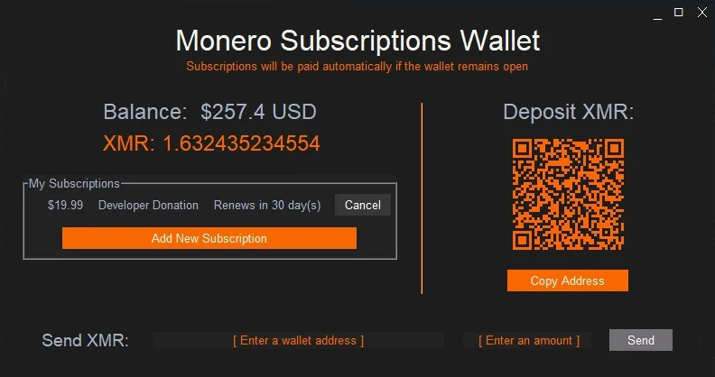

# Monero Subscriptions Wallet


> :warning: The open source GUI library that we use now requires a license. We are working on migrating to a replacement GUI library.

A Monero wallet that automatically pays subscriptions.

<p align="center">
  <br><br>
</p>


# How To Use:

(Video Coming Soon)

* Make sure you have [Python 3.8](https://www.python.org/downloads/) or newer installed
* [Download the Monero Subscripton Wallet files](https://github.com/lukeprofits/Monero_Subscriptions_Wallet/archive/refs/heads/main.zip) extract all the files from the .zip you downloaded and put them in a folder
* [Download the Monero CLI Wallet](https://www.getmonero.org/downloads/#cli), extract all the files from the .zip you downloaded and put them in the same folder

* Optional: Download and install [the font Nunito Sans](https://fonts.google.com/specimen/Nunito+Sans)
* On Windows, double click the "Windows_Launcher" file
* On Mac/Linux, run the "Mac_Linux_Launcher" file 
* Or if you are comfortable with the terminal, on any OS open your console and enter the command: `python Monero_Subscriptions_Wallet.py`
* On Linux there are some required clipboard packages. For non-wayland sessions they are: xclip and xsel, for wayland sessions it is: wl-clipboard. Make sure to install them with your package manager.


# Donate
If you use this, send me some XMR. It took weeks to develop, and I did not ask for, or recieve any [CCS funding](https://ccs.getmonero.org/) for this project.

- XMR: ```4At3X5rvVypTofgmueN9s9QtrzdRe5BueFrskAZi17BoYbhzysozzoMFB6zWnTKdGC6AxEAbEE5czFR3hbEEJbsm4hCeX2S```
- BTC: ```1ACCQMwHYUkA1v449DvQ9t6dm3yv1enN87```
- Cash App: `$LukeProfits`
<a href="https://www.buymeacoffee.com/lukeprofits" target="_blank">
  
</a><br><br>


$10/mo XMR donation: 
```
monero-request:1:H4sIAAAAAAAC/y1QXU/DMAz8KyjPG0o/ttK+tWuHBAKJrcDYS5Q07hqRJlOSDlrEfyedkCzZd2edT/5BtNeDcihDAb7FGC1Q01F1AiIUFw112pDBSC/PymAMqGb06HVfXgnrdE8kZTCvlHABqc9gbkqtqBNa+R1OR0s8R5iQUqgTacZGAsoivEBq6JlXdEvOdOxBOYsyT/8DIrg3je9YG4dxgoEFIU9Tb2lBSjCWfFHf5+hx7qLDylzexnOt21M/wHNq0xdnJr6DVTHA1tjP/CiCpNAfrJtGq6dJP22L9fSu6kd+v1nn31XOqmrVTNtd1Pnpgdk+7jZwCPfzSUeNI5w6nxyFOIyWAV6GSY1xdi3/OnxEv3/sOZmDTwEAAA==
```


$25/mo XMR donation: 
```
monero-request:1:H4sIAAAAAAAC/y1QbU+DMBD+K6afN9PxMoRvbICJRhM31LkvTaEHNJaWtGUKxv9uWUwuuXte8tzlfhDt1SgtSpAX3mKMVqjuqGyBcMl4Ta3SZNTCyYsyag2ynhx6PWZXwljVE0ErWCwZXECoAfRNpiS1XEnnYXQyxHGk4kJw2ZJ6qgWgxMcrJMe+copqyECnHqQ1KHH0PyCcudCNH0TMCyjz7mgUR42LNCAEaEO+qOvL6UFq/VOoL2/TUKqm7Ud4jk38YvXMDhDuRii0+UzPfBPt1EfVzZNR86yeit12fpflI7vfb9PvPK3yPKzn4uB3bnqoTB90ezh5x2WlpdoSRi0sn8Kev97gtReVGCfXcq/DZ/T7B8ifH4xPAQAA
```


# Tools For Merchants
* Recommended: [Monero Payment Request Creator Website](https://monerosub.tux.pizza/)
* [Monero Payment Request Creator Website Source Code - HOST IT YOURSELF!](https://github.com/lukeprofits/Monero_Subscription_Code_Creator_Website)
* [Monero Payment Request Creator Pip Package](https://github.com/lukeprofits/monerorequest)
* More monero-request integration tools coming soon...


# Documentation For Merchants
* [How To Create `monero-request` codes](https://github.com/lukeprofits/Monero_Payment_Request_Standard)


## Features
* Automatically send recurring payments without a middleman
* Add payment requests from merchants, or create them manaually
* Send donations to your favorite content creators (or developers) on a set schedule
* Supports Subscriptions Billing: Daily, Weekly, Monthly, Yearly, or anything in between!
* Supports one-time, recurring, and fixed-number-of payments 


## Works On
- Windows
- Linux
- Mac - Testing Needed


## Requirements
* [Python 3.8](https://www.python.org/downloads/) or above
* [Monero CLI Wallet](https://www.getmonero.org/downloads/#cli)
* [psutil](https://github.com/giampaolo/psutil)
* [requests](https://github.com/psf/requests)
* [clipboard](https://pypi.org/project/clipboard)
* [lxml](https://github.com/lxml/lxml)
* [monero_usd_price](https://github.com/lukeprofits/Monero-USD-Price)
* [PySimpleGUI](https://github.com/PySimpleGUI/PySimpleGUI)
* [qrcode](https://github.com/lincolnloop/python-qrcode)
* [monerorequest](https://github.com/lukeprofits/monerorequest)


## Discussion 
* [Monero Topia - Odysee](https://Odysee.com/@MoneroTalk:8/monero-subscription-wallets-goes-live:6) 
* [Monero Topia - YouTube](https://youtu.be/ZUNQ-FaI638)
* [Monero Talk - YouTube](https://www.youtube.com/live/tkGwtsMi_1c?feature=share) 

## License
[MIT](https://github.com/Equim-chan/vanity-monero/blob/master/LICENSE)
